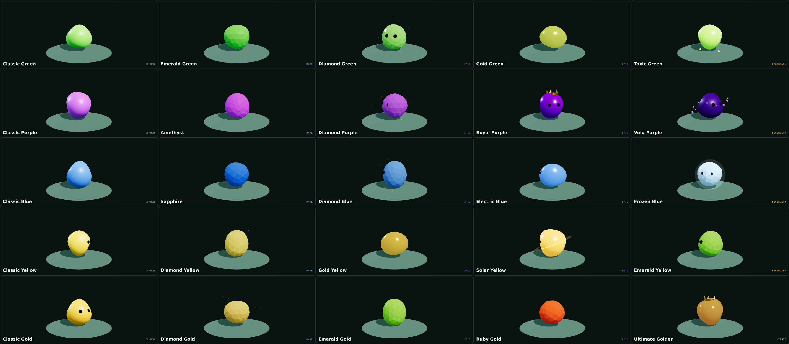

# Blob Mania

A 3D arena brawler for the web. You're a blob. You dig up new blobs. You turn them to diamond,
emerald, ruby or solid gold — and then you shoot other blobs with them.

**Designed by Sam.**



## Play it

```bash
node server.js        # → http://localhost:3000
```

No install, no dependencies, no build step. `server.js` is plain Node serving `public/`.

**Controls** — `WASD` move · mouse aim · click shoot · **right-click or `F` harpoon** · `Shift` dash · `Space` super · `G` gadget · `E` dig or dive · `Esc` menu.

**On a phone** it plays in landscape: drag the left side to move, tap the right side to shoot, and
use the DASH / SUPER / GADGET / HARPOON / DIG buttons on the right. Add it to your home screen from Safari's share
menu and it opens full-screen with its own icon, no browser bars.

## What's in it

- **Five blobs** — Green, Purple, Blue, Yellow and the million-gold Gold Blob. Each has its own
  weapon, health, speed and Super.
- **25 skins** that change your blob's *body*, not just its shot. Fourteen material recipes —
  crystal, metal, energy, smooth — applied to your blob's own colour, so Diamond Green is a green
  gem rather than a white one. Royal wears a crown, Void has shards orbiting it, Electric arcs
  lightning, Toxic drips, Solar spins a corona, Ultimate Golden is molten gold.
- **Digging** — three digs at a mound discovers the next brawler, in a fixed order. Gold buys it.
- **Difficulty** — Easy, Medium, Hard or Grandmaster, chosen in the lobby. Harder rivals are
  faster, tougher, more accurate and more numerous, and they pay more gold and XP. Grandmaster
  aims where you're going.
- **Levels** — each brawler levels 1–10 by being played (damage, splats, goals, digs, wins), and
  each level is +5% health and +5% damage on that brawler. Levels are earned, never bought.
- **Four modes** — Dig & Fight, and three sports on real marked courts: Blob Hoops (first to 6,
  with a hoop that slides along the back line), Blob Kickoff (first to 2) and Blob Volley (first
  to 3). Dying in a sport respawns you at the centre circle after three seconds.

**The rule the whole game rests on:** a skin changes how you look and how your shot lands. It
never changes damage. The code enforces it — damage functions never receive a skin.

## Deploy to Railway

1. [railway.app](https://railway.app) → **New Project** → **Deploy from GitHub repo** → this repo.
2. That's it. Railway reads `railway.json` and `package.json` and runs `node server.js`.
   No environment variables, no database, no root directory to set.
3. **Settings → Networking → Generate Domain** for the public URL.

From the CLI instead:

```bash
npm i -g @railway/cli
railway login && railway init && railway up
```

## Layout

```
server.js            zero-dependency static server, honours $PORT
package.json         start script + node engine
railway.json         Railway build and deploy config
build-artifact.js    builds the shareable single-file version
public/
  index.html         the whole game — markup, CSS and all game code
  vendor/three.min.js  three.js r128, vendored so there's no CDN dependency
docs/
  DESIGN.md          the full design doc: brawlers, skins, modes, economy, roadmap
  preview-2d.html    the earlier 2D design preview
  skins.png          all 25 skins
```

The game is one file on purpose — everything in one place, no build step, which matters more
than tidiness when one person is iterating on it.

## Editing it

`public/index.html` reads top to bottom in five parts: markup and CSS · config (`BLOBS`, `VAR`,
`SKINS`, `MODES`) · the skin factory (`makeBlob`) · the engine · the modes and frame loop.

Two things to know before you change anything:

- **Every colour goes through `C()`.** three r128 with sRGB output renders raw hex pale and
  desaturated. If a new colour looks washed out, it skipped `C()`.
- **All balance lives in `BLOBS`.** Health, damage, speed, fire rate, reload, range. Nothing is
  hard-coded in the gameplay functions, so tuning is a one-place change.

## Roadmap

`docs/DESIGN.md` is the plan. The big one still ahead is **multiplayer** — real friends, parties,
and even teams — which needs an authoritative server. Everything else (more modes, sound, more
arenas) is smaller than that.
